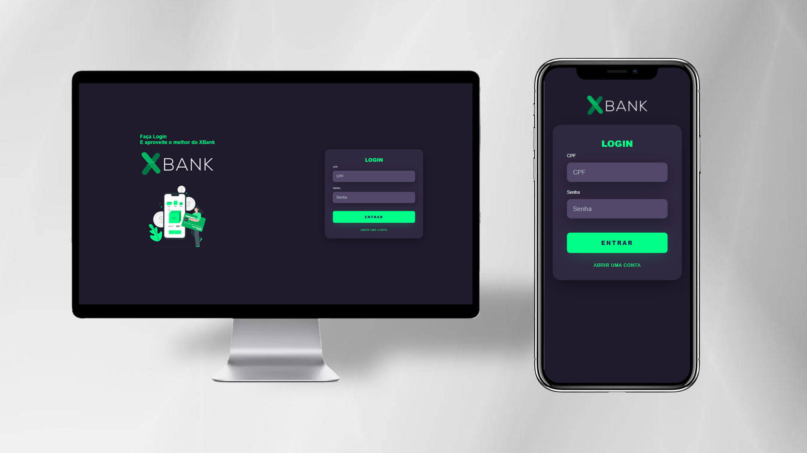

  

<h1>XBank - Banco Digital</h1>

<h3 align = "center">
  Um banco moderno na palma da sua mão!
</h3>

<h4 align = "center">
	✅ XBank - Versão 1.0 ✅
</h4>

 

 <a href="#visao">Visão geral</a> •
 <a href="#leng">Linguagens</a> •
 <a href="#contato">Contato</a>  

 
 
 

<h1>  Visão geral </h1>

XBank possui um layout moderno e responsivo de um Banco Digital fictício, desenvolvido com HTML, CSS. O foco principal é treinar habilidades principalmente no desenvolvimento moderno com a presença de banco de dados em PHP e interações com JavaScript. 

 
 
 
 

<h1>  Linguagens utilizadas </h1>

 
  
  
   
   

 
 
 
 

<h1> Como entro em contato? </h1>

Entre em contato através dos links a seguir!
 
 

 
 
 